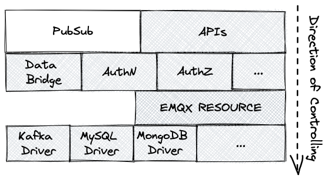
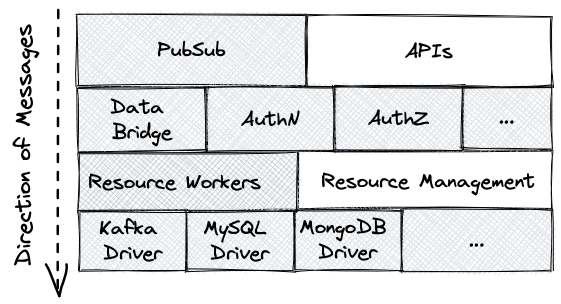

# The Message Cache for Resources

```
Author: <Shawn Liu> <506895667@qq.com>
Status: Draft
Created: 2021-07-11
```

## Abstract

This proposal suggests adding the message cache plane to the `emqx_resource` layer for emqx data integration.

## Motivation

The purpose of message caching is to cache messages locally (possibly disk or memory) when the external resource service is interrupted, and then replay messages from the message queue after the resource is back to service.

In emqx 4.x and previous versions, only a few drivers implemented the message caching function (Kafka and MQTT Bridge)

In 5.0 we suggest build the message caching function as part of the resource layer, which has the advantage of no need to change any of the drivers.

Based on this message cache plane, we can realize the sync/async querying mode and batching ability in the resource layer.

## Design

### RocksDB vs. ReplayQ

There are two choices to implement the message queue. One is the mnesia database using RocksDB as the backend, and the other is the [replayq](https://github.com/emqx/replayq).

We prefer the `replayq`, mainly because in this feature messages are always added and accessed in a queue, we never access data by primary keys like a KV database. This is exactly the applicable scenario of `replayq`. The data files will be stored in the specified directory of the local file system, which is very simple.

After `replayq` was added to the Kafka driver 2 years ago, it has experienced several emqx versions and has been proved to be very stable.

### The Resource Layer before the Change

Before adding the message cache functionality, the hierarchical structure of the data integration part for sending a message is shown as the following figure:


At the top is the pub/sub and the API layer. The messages/queries are sent to the components in the second layer via `emqx_hooks` callbacks.

The second layer is the components related to external resources, such as Data Bridge, Authentication (AuthN), Authorization (AuthZ), etc.

The third layer is the resource layer, which is responsible for maintaining the status of resources, as well as management operations such as creation and update of resources.

At the bottom is the DB drivers, they are Erlang clients to various data systems, such as Kafka, MySQL, MongoBD, etc.

The MQTT connection process calls `emqx_resource:query/3` to send messages, and the messages flow through all the layers from top to bottom.

A user can create/update/delete resources via HTTP APIs, the API then calls emqx_resource to do the resource management works:



The resource management calls through all the layers from the top to the bottom.

### Add Resource Workers to the Resource Layer

After this feature, the hierarchical structure of the data integration part for sending a message is shown in the following figure:



The resource layer is divided into two parts: data and control. The data part is the message caching component, we call it the "resource workers", which is responsible for maintaining the message queue, and sending the messages to the drivers. The control part remains unchanged as before, which is responsible for resource management operations:


### Pool of Resource Workers with ReplayQs

In the current implementation, each time a resource is created, a resource manager process will be created for each resource ID, which is responsible for maintaining the relevant state of the resource. See the code of `emqx_resource_manager` module for details.

After the implementation of message caching is added, we also create a resource worker pool each time a resource is created, which is responsible for the process of accessing resources and message sending.

The following figure is a schematic diagram of the resource worker pool. Each worker maintains a ReplayQ:


The messages are first saved by the worker to the queue (which can be memory or disk queue), and then according to the batching policy, the worker takes the message out of the queue and sends it to the corresponding driver through the connector callback modules.

Here is the sequences for querying a resource after the resource workers are added:


- When creating the resource worker pool, we can specify the `max_batch_num`, `batch_interval` parameters to control the batching process.
- Every time a caller calls the resource worker, it can specify `query_mode = sync | async` for control whether wait the result or not.

## Configuration Changes

Some new (optional) config entries are added to the data-bridges, authentication and authorization components:

- **max_batch_num**: the maximum messages can be sent in a single batch.
- **batch_interval**: the maximum time in milliseconds the worker will wait before sending out a batch.
- **query_mode**: if set to true, the caller of `emqx_resource:query/3` will be blocked until
the driver returns or timeouts; if set to false, the `emqx_resource:query/3` returns immediately.

For example, here is a config for bridging EMQX to a remote MQTT broker at "broker.EMQX.io:1883":

```
bridges.mqtt.my_egress_mqtt_bridge {
    connector = {
        server = "broker.EMQX.io:1883"
        username = "username1"
        password = ""
        ssl.enable = false
    }
    direction = egress
    remote_topic = "from_emqx/${topic}"
}
```
After this feature, we can add the new config entries like this:

```
bridges.mqtt.my_egress_mqtt_bridge {
    connector = {
        server = "broker.EMQX.io:1883"
        username = "username1"
        password = ""
        ssl.enable = false
    }
    direction = egress
    remote_topic = "from_emqx/${topic}"

    max_batch_num = 100
    batch_interval = 20ms
    query_mode = async
}
```

## Backwards Compatibility

It is backward compatible to 5.0.4.

## Document Changes

Docs for Data Bridges/Authentication/Authorization need to be updated with the
newly added configurations.

## Testing Suggestions

Benchmarking need to be done to see how the resource workers impact on the performance.
